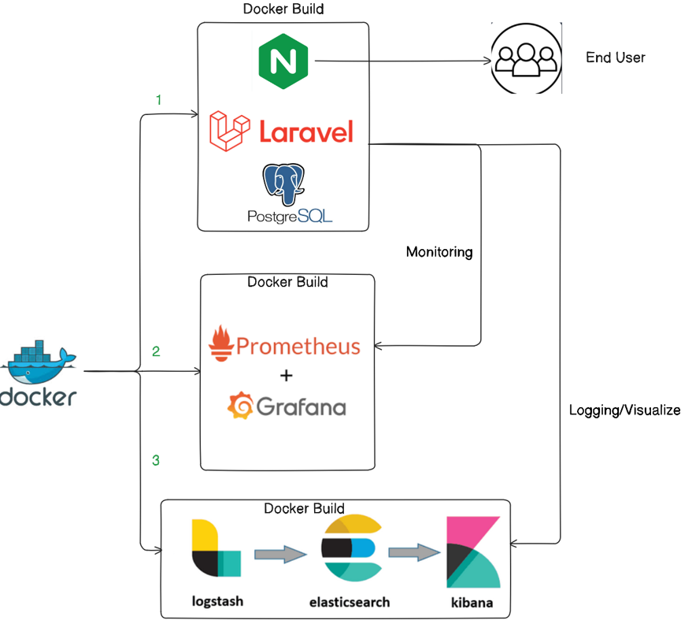

# README

## Overview


## Steps to run and configure ELK Stack with Monitoring
1. Clone the environment
    ```bash
    git clone -b ribesh-main http://gittest.midashealthservices.com.np/task/laravel-app.git
    ```

2. Go inside the Laravel folder
    ```bash
    cd laravel-app
    ```

3. Run the commands
    ```bash
    mkdir esdata
    cp .env.example .env
    ```

4. Bring Laravel/Web Application Up
    ```bash
    docker compose -f docker-compose.yaml up -d --build
    ```

    4.1 Verify the application
        ```bash
        curl http://localhost:8080
        ```

    4.2 Generate the **APP_KEY** 
        ```bash
        docker exec -it admin-app php artisan key:generate
        ```

    4.3 It should update the `.env` file in host as well
        ```bash
        cat .env | grep APP_KEY
        ```

5. Bring Promethus and Grafana Up
    ```bash
    docker compose -f monitoring-task3.yaml up -d 
    ```

6. Bring ELK Stack Up
    ```bash
    docker compose -f elk-compose.yaml up -d
    ```

---

## Application Details

| No. | Application           | URL | Credentails         | Description | Endpoints
|-----|----------------|--------------|----------------|-------------|--------------|
| 1 | Laravel  | http://192.168.130.166:8080           |  -      | Web Application     | /login  /register|
| 2 | Prometheus Dashboad     |  http://192.168.130.166:9090      | -      |  Prometheus Dashboard     |
| 3 | Grafana Dashboad | http://192.168.130.166:3000      | admin P@ssw0rd01     | Grafana Dashboard      |
| 4 | cadvisor   | http://192.168.130.166:8081/containers/   | -        |    Fetches Metrics   |  
| 5 | Kibana      | http://192.168.130.166:5601/app/home#/      |    |    Central Log Server   |       |


## Monitoring

|No.| Application | URL | Description |
|---|-------------|-----|-------------|
| 1 | Grafana     |http://192.168.130.166:3000/d/bec0b22d-b951-48a9-b71d-c3b06d5d0938/container-cpu-memory-utlization?orgId=1&from=now-15m&to=now&timezone=browser&refresh=30s | Container CPU/ Memory Utlization
|2 | Grafana      |http://192.168.130.166:3000/d/xtkCtBkiz/app-response-time?var-interval=10s&orgId=1&from=now-3h&to=now&timezone=browser&var-target=http:%2F%2F192.168.130.166:8080&refresh=5s | App Response Time
|3 | ELK Stack    | http://192.168.130.166:5601/app/dashboards#/view/1244585d-2ade-49ce-97ab-f40dc5e1f80a?_g=(filters:!(),refreshInterval:(pause:!f,value:10000),time:(from:now-10h,to:now))| Central Logging & Visualize 


## Screenshots
### Laravel Application

Laravel Application Home Page


Login into Laravel Application

---

### Graphana & Prometheus


This image shows the dashboad, where you get the **health checks for endpoints** using prometheus


This image shows the dashboard interface, where system metrics such as **CPU** and **Memory** visualized using Grafana panels.


This image shows the dashboard interface, where it **checks for app up time** using Grafana panels.

---
### Kibana

This image shows the dashboard interface, where you can visualize logs using Kibana.

*Note - Due to the huge amount of logs generated, it might make the docker host full causing problems to visualize logs*


